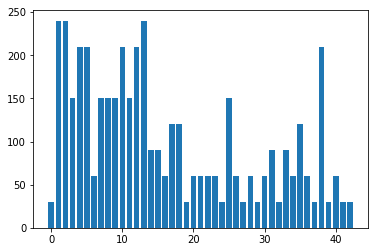
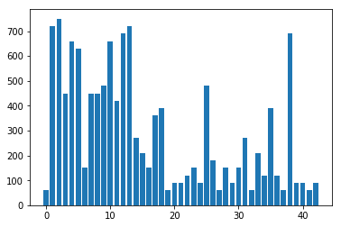
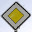
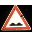
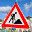

# Self-Driving Car Technology - Traffic Sign Recognition

## Overview

Autonomous vehicles may use many different types of inputs to help them perceive the environment around them and make decisions about how to navigate. Regardless of any combination of radar or lidar sensors to determine the location of an object in the world around it, using live camera images allow a much greater ability to classify objects around the vehicle once they are detected.

When operating on roadways, autonomous vehicles need to be able to identify traffic signs in order to determine what new actions, if any, need to happen in the near future. For example, a yield sign warns drivers that other vehicle traffic will soon enter the vehicle's path, and that those other vehicles should be given the right of way. Without a robust mechanism to quickly and correctly identify the meaning of traffic signs, autonomous vehicles would get into trouble with hazardous road conditions and with other vehicles.

This repository contains a codebase which uses deep neural networks and convolutional neural networks to classify traffic signs. The codebase trains and validates a neural network model so it can classify traffic sign images using the [German Traffic Sign Dataset](http://benchmark.ini.rub.de/?section=gtsrb&subsection=dataset). Additionally, a study of model performance on images of unseen German traffic signs from the internet is included.

## Repository contents 
* [README.md](readme.md) - this readme
* [examples](examples) - directory with original examples from course
* [Traffic_Sign_Classifier.ipynb](Traffic_Sign_Classifier.ipynb) - project code in a Jupyter notebook
* [Traffic_Sign_Classifier.html](Traffic_Sign_Classifier.html) - project code output in HTML page
* [testdata](testdata) - directory with five German traffic signs collected from the internet for testing the final classifier
* taynn* files - saved model generated by project

[//]: # (Image References)

[image1]: ./examples/visualization.jpg "Visualization"
[image2]: ./examples/grayscale.jpg "Grayscaling"
[image3]: ./examples/random_noise.jpg "Random Noise"
[image4]: ./testdata/12.jpg "Traffic Sign 1"
[image5]: ./testdata/18.jpg "Traffic Sign 2"
[image6]: ./testdata/22.jpg "Traffic Sign 3"
[image7]: ./testdata/25.jpg "Traffic Sign 4"
[image8]: ./testdata/38.jpg "Traffic Sign 5"


## Data Set Summary & Exploration

### Dataset summary

The pandas library is used to calculate summary statistics of the traffic signs data set:

* The size of training set is 34799
* The size of the validation set is 4410
* The size of test set is 12630
* The shape of a traffic sign image is (32, 32, 3)
* The number of unique classes/labels in the data set is 43

### Exploratory visualization of the dataset

The following charts show the distribution of the instance classes in the training, validation, and test datasets.

Note how in all of the datasets, some of the classes (1-5,7-10,12-13,38) have a much higher representation in each dataset than others. This may cause bias in the predictions generated by the classifier itself; additional classification robustness could be added by adding extra instances of the classes which are under-represented.

**Training data instance class distribution**


**Validation data instance class distribution**



**Test data instance class distribution**



## Design and Testing of model architecture

### Image data preprocessing

As a first step, all images are converted to grayscale to reduce the dimensionality of the problem that the classifier needs to learn. Given the small number of training examples (< 100k), the extra dimensionality in representing colors might overwhelm the optimizer and it would not fit a robust model. Grayscale was also used in [my previous lane finding project](https://github.com/dinoboy197/CarND-LaneLines-P1), and given the success of finding detail in a low-resolution grayscale image similar success here is expected.

Here is an example of a traffic sign image before and after grayscaling.

![alt text][image2]

As a last step, image data is normalized to have mean zero and low standard deviation for each pixel value, to allow the learning optimizer to have an easier time converging on a lower overall classification loss.

Even though a class imbalance exists in the training data set, the training set is not augmented with more data to study the bias of the final classifier (which would be revealed during the validation step).


### Final neural network architecture

The neural network model consists of the following layers:

| Layer         		|     Description	        					| 
|:---------------------:|:---------------------------------------------:| 
| Input         		| 32x32x1 grayscale image   					| 
| Convolution 5x5     	| 1x1 stride, valid padding, outputs 28x28x6 	|
| RELU					|												|
| Max pooling	      	| 2x2 stride,  outputs 14x14x6 				    |
| Convolution 5x5	    | 1x1 stride, valid padding, outputs 10x10x16   |
| RELU					|												|
| Max pooling	      	| 2x2 stride,  outputs 5x5x16 				    |
| Fully connected		| 400 input neurons, 400 output neurons        	|
| RELU					|												|
| Dropout				| 50% keep fraction								|
| Fully connected		| 400 input neurons, 400 output neurons        	|
| RELU					|												|
| Dropout				| 50% keep fraction								|
| Fully connected		| 400 input neurons, 43 output neurons        	|
| Output - Softmax		| Output           								|


### Model training

To train the model, the following techniques are used:

* Use of a loss function which [reduces the mean of the softmax cross entropy between the output and the validation labels](https://www.tensorflow.org/api_docs/python/tf/nn/softmax_cross_entropy_with_logits)
* Penalization of the loss using L2 regularization for each of the five weight groups in the network (2x convolution weight groups and 3x fully connected layer weight groups), scaled to 1% of the [L2 norm](https://www.tensorflow.org/api_docs/python/tf/nn/l2_loss)
* Optimization of the weights and biases for each of the layers using the [Adam algorithm](https://www.tensorflow.org/api_docs/python/tf/train/AdamOptimizer), with an initial learning rate of 0.0005 (the Adam optimizer dynamically adjusts the effective learning rate over time)
* Mini-batching of 128 training instances looped with a maximum of 200 epochs of training and weight optimization until the accuracy is above 93.5%. 93.7% is hit after 16 epochs, at which point the training loop completes.

### Improving validation set accuracy

The final model results are:
* training set accuracy of 97.0%
* validation set accuracy of 93.7%
* test set accuracy of 90.5%

The neural network began with the classic [LeNet-5 image classification architecture](https://en.wikipedia.org/wiki/Convolutional_neural_network#LeNet-5), being a canonical and well-understood image classification neural net architecture for grayscale image classification. This seemed like an obvious starting point to classify small (32x32 pixel) grayscale images with a limited set of output classes (43).

Modifications are added based on the [Alexnet image processing architecture](https://en.wikipedia.org/wiki/AlexNet), as it is also well-understood and makes sigificant performance improvements on LeNet. Further modifications include using 50% dropout layers after every fully connected layer to prevent overfitting on training data, making the fully connected layers not reduce dimensionality (input and output dimensions are the same until the final output layer), and starting with initial positive values for layer bias terms rather than zero (since ReLU is used as an activation function, it is desired to prevent more connections to drop out than absolutely necessary).

Training set accuracy shows that the model is fitting to the training data well; perhaps too well, as a 97% accuracy is quite high. Luckily, the difference in performance between the validation and training sets (delta of 3.3%) shows that the model is not overfitting too greatly. Test set accuracy of 90.5% indicates that on completely unseen data in the real world, this classifier would classify slightly better than nine of out ten traffic signs correctly, which is interesting academically but surely would be a problem for a true self-driving car (as even one incorrectly classified traffic sign could prove disasterous).

### Validation with images from the internet

#### Sample images

Here are five German traffic signs that were pulled from the internet:

**General Caution**


This image may be harder to classify, as it has a changing background image due to the horizon.

**Priority Road**



This is likely to be a simple image to classify; it is clear with an empty background.

**Bumpy Road**



This image has a solid, though black, background which is likely to be easy to classify (even with a small fleck of black in the right side of the triangle).

**Road Work**



This image is likely to be difficult to classify, being captured at a non-perpendicular angle, as well as having a complicated background involving the ground, sky, and clouds of different colors and shapes.

**Keep Right**


This image should be relatively easy to classify; it has some background noise but the image itself is clear except for some clipping at the bottom of the circle.


#### Comparision of predictions from original set and internet images

Prediction results:

| Image			        |     Prediction	        					| 
|:---------------------:|:---------------------------------------------:| 
| General Caution    	| General Caution								| 
| Priority Road     	| Priority Road 								|
| Bumpy Road			| Bicycles Crossing					     		|
| Road Work	      		| Road Work					 			    	|
| Keep Right			| Keep Right      						     	|


The model is able to correctly guess 4 of the 5 traffic signs, which gives an accuracy of 80%. Due to the limited number of test examples in my set of 5, the accuracy of 80% is lower than the original test set accuracy of 90.5%.

#### Softmax probabilities

The code for making predictions on the final model is located in one of the last cells of the Ipython notebook.

For the first image, the model is almost completely sure that this is a General Caution sign (probability of 0.99), and the image does contain a General Caution sign. The top five soft max probabilities are

| Probability         	|     Prediction	        					|
|:---------------------:|:---------------------------------------------:|
| .99         			| General Caution   							|
| .01     				| Pedestrians  				            	   |
| .00					| Traffic Signals								|
| .00	      			| Road Narrows on the Right		 				|
| .00				    | Right-of-way at the next intersection			|


For the second image, the model is almost sure that this is a Priority Road sign (probability of 0.95), and the image does contain a Priority Road sign. The top five soft max probabilities are

| Probability         	|     Prediction	        					|
|:---------------------:|:---------------------------------------------:|
| .95         			| Priority Road   			  		      		|
| .02     				| Yield 								        |
| .02   				| No Vehicles						       		|
| .01	      			| No Passing		 			               	|
| .00				    | Ahead Only		                         	|

For the third image, the model is almost sure that this is a Bicycles Crossing sign (probability of 0.95); however, the image contains a Bumpy Road sign. Note that Bumpy Road is the second highest softmax probability, but it much less confident about this prediction. The top five soft max probabilities are

| Probability         	|     Prediction	        					|
|:---------------------:|:---------------------------------------------:|
| .95         			| Bicycles Crossing   							|
| .03     				| Bumpy Road 								    |
| .02					| Dangerous Curve to the right					|
| .00	      			| Road narrows on the right		 				|
| .00				    | Road work			                             |

For the fourth image, the model is almost completely sure that this is a Road Work sign (probability of 0.99), and the image does contain a Road work sign. The top five soft max probabilities are

| Probability         	|     Prediction	        					|
|:---------------------:|:---------------------------------------------:|
| .99         			| Road work   						           	|
| .00     				| Bumpy road 								    |
| .00					| Bicycle crossing								|
| .00	      			| Road Narrows on the Right		 				|
| .00				    | Slippery Road                            		|

For the fifth image, the model is most confident that this is a Keep Right sign (probability of 0.46), and the image does contain a Keep Right sign. Note that the "second place" probability for Speed Limit (30km/h) is not far behind. The top five soft max probabilities are

| Probability         	|     Prediction	        					|
|:---------------------:|:---------------------------------------------:|
| .46         			| Keep Right   						          	|
| .35     				| Speed Limit (30km/h) 						    |
| .18					| Roundabout Manadatory							|
| .00	      			| Speed Limit (50km/h)		 			     	|
| .00				    | Priority Road                        			|


## Running code from this repository

Running the code in this repository requires that the Udacity CarND Term1 Starter Kit to be properly installed. Click [here](https://github.com/udacity/CarND-Term1-Starter-Kit/blob/master/README.md) for the details.

Once the starter kit is installed and activated, you may run:

```sh
jupyter notebook Traffic_Sign_Classifier.ipynb
```